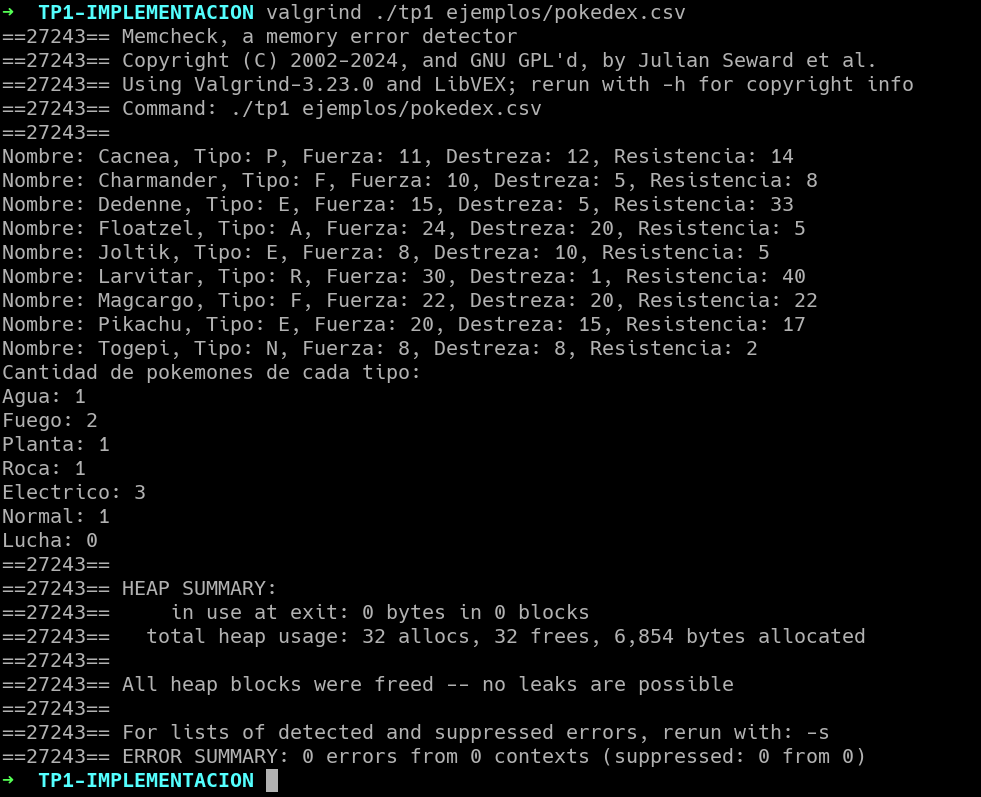

# TP1: Archivos, strings y muchos punteros

Se pide implementar la funcionalidad de los 2 archivos **.h** provistos. El primer archivo consiste en una utilidad que permite leer y parsear archivos csv de a líneas. El segundo archivo provee funcionalidades que permiten administrar y utilizar una pokedex con datos de diferentes pokemon. En cada archivo de cabecera se encuentra la descripción del funcionamiento de cada función.

Adicionalmente se pide la implementación de ***tp1.c*** que dado un archivo csv con datos de pokemon carga los datos en una pokedex y muestra los datos de los pokemon por pantalla en orden alfabetico.

---

## Consejos para la elaboración del trabajo

**LEER EL ENUNCIADO** primero y luego **la descripción de las funciones**. Importantísimo. 

**NO** escribas código a lo loco sin compilar cada tanto. Implementá la solución de a poco y compilando a cada paso. Dejar la compilación para el final es uno de los peores errores que podés cometer. Para la compilación del trabajo se provee un **Makefile**. Utilizá el comando **make** frecuentemente para compilar y correr el programa.

**NO** avances en la implementación si quedan errores sin resolver en alguna prueba. Cada vez que escribas una prueba implementá toda la funcionalidad necesaria para que funcione correctamente. Esto incluye liberar memoria y accesos inválidos a la misma. Solamente una vez que hayas logrado que la prueba pase exitosamente es que podés comenzar a escribir la próxima prueba para continuar el trabajo.

**NO** está permitido modificar los archivos **.h**. Se pueden hacer modificaciones al **makefile**, pero recordá que el trabajo debe ser compilado por el sistema de entregas con las cabeceras y el **makefile** original. Caso contrario el trabajo se da por desaprobado.

---

## Puntos teóricos

 - Explicar con diagramas cómo quedan dispuestas las estructuras y elementos en memoria.
 - Explicar la complejidad computacional de **cada una** de las funciones que se piden implementar.
